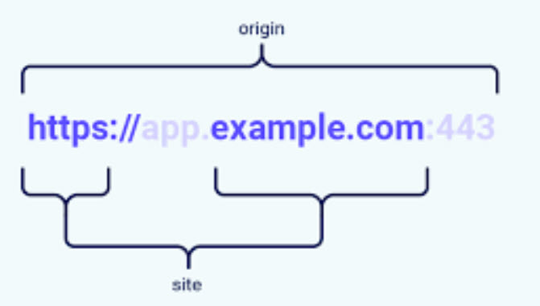
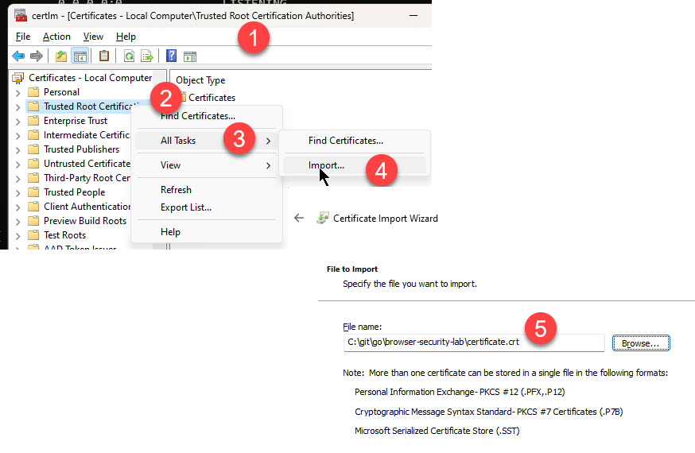
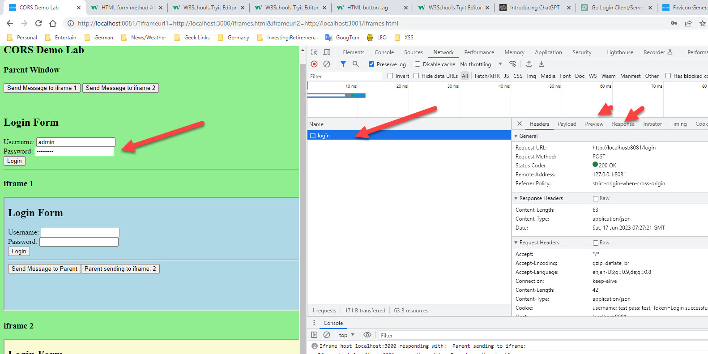
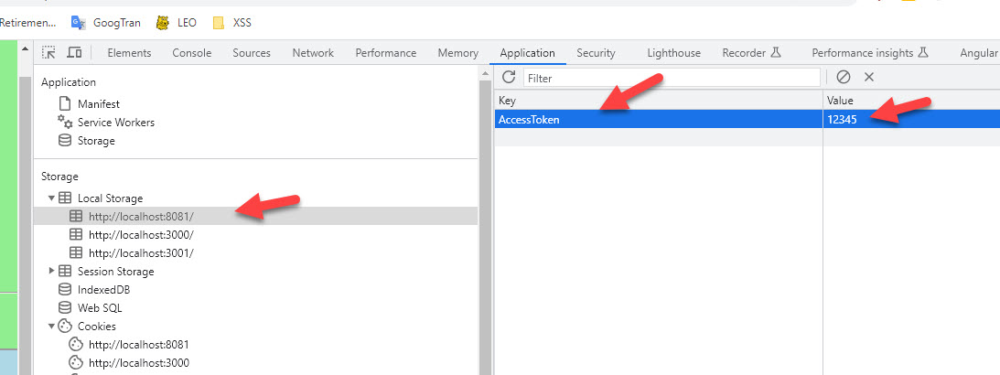
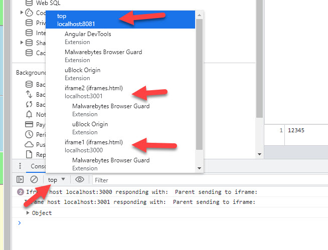
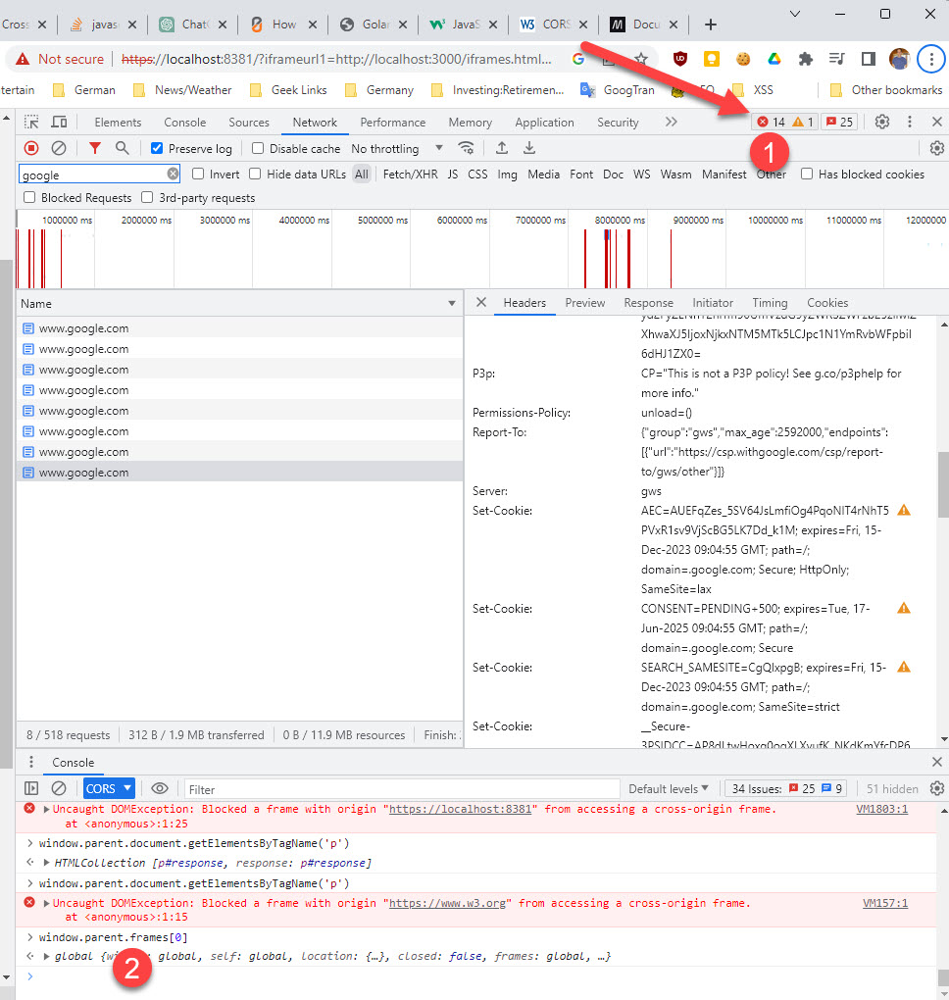

- [CORS Demo Lab](#cors-demo-lab)
  - [Background](#background)
    - [Lesson 1: Where does Origin Come From?](#lesson-1-where-does-origin-come-from)
    - [Lesson 2: Site vs Origin..](#lesson-2-site-vs-origin)
  - [Lab Overview](#lab-overview)
  - [Installation](#installation)
  - [Usage](#usage)
    - [Use Browser Debugger to inspect CORS traffic](#use-browser-debugger-to-inspect-cors-traffic)
    - [Start Program](#start-program)
    - [Cross-Origin Queries](#cross-origin-queries)
      - [LocalStorage](#localstorage)
      - [getElementByTagName()](#getelementbytagname)
      - [Cookies](#cookies)
      - [Forms](#forms)
      - [PostMessage](#postmessage)
      - [X-Frame Options](#x-frame-options)
      - [JS fetch](#js-fetch)
  - [Change History](#change-history)
  - [Contributing](#contributing)
  - [License](#license)


# CORS Demo Lab

## Background
One of the elements missing when watching YouTube videos explaining technology, is the hands on experience
to explore the "What Ifs" along with seeing both sides of the client-server interaction on a step-by-step
basis. This is the only way to fully understand how a technology works.

[Same-Origin-Policy SOP](https://developer.mozilla.org/en-US/docs/Web/Security/Same-origin_policy) states that in a browser, data from one origin cannot be accessed by a different origin. [Cross-Origin-Requests CORS](https://www.w3.org/TR/2020/SPSD-cors-20200602/) is a way of permitting cross origin access for HTTP requests (but not internal JS access?????????????check this????????????????????????). SOP and CORS are easy to understand at a high
level, but once one reads all the rules behind it, becomes very complex . There are a lot of "Rule XXX is always true EXCEPT in these cases" (localStorage vs cookies, img vs GET response, JS internal data vs HTTP data, * vs nil, one one domain allowed per Allow-Origin). One can understand that as a developer working in a 2-week sprint, one would just throw up their hands and find the easiest way to bypass all these restrictions because it is too complex to try and understand them.


So in order to explore the intracies of CORS "What-Ifs", I created a Golang based CORS lab. Developers can use this lab to better understand the "What-Ifs"of CORS, and hopefully work within its limitations vs coding around them.


### Lesson 1: Where does Origin Come From?

When a browser/render loads a page from a website, the browser tags that page with a Origin attribute in the DOM. This attribute is used to determine which windows/frames can see what data.


### Lesson 2: Site vs Origin..

Same Origin Policy states that JavaScript cannot access data across Origins. What is an Origin?
An origin is very strict, the whole url domain from 'h' to portnumber will make a match. Subdomains are not in the same Origin.
Site is more flexible, subdomains are in the same Site. These are used in cookie restrictions.



## Lab Overview

This CORS security lab allows users to explore both the client and server
side of CORS. Users can manipulate both the Client JavaScript and Server GO HTTP header CORS
attributes and view what the results are.

This is done thru the use of a main program and two iframes, all in different origins via
unique port numbers. The main program is a web server that forks to sub-processes all with
different port numbers which makes the document.location.origin unique. 


Users can then switch between the 3 JS contexts (main, iframe1, iframe2) and view how CORS impacts accessing data
from the different origins. Users can do this with:


- localStorage - Can one access local storage between origins?
- getElementById() to retrieve DOM data between origins and see response
- cookies - can one see cookies between origins?
- Forms - Post login and try to view response
- postMessage between iframes to retrieve data
- JS fetch - can one fetch/HTTP GET and view response between origins


## Installation

<hr>
 Create a golang HELLO WORLD project---------------
- https://go.dev/doc/install
- Download     https://go.dev/dl/
- https://go.dev/doc/tutorial/getting-started

<hr>
 Install CORS lab ---------------
- cd ..
- git clone https://github.com/dreezman/CORS-Demo-Lab.git
- cd CORS-Demo-Lab

<hr>

In order to avoid certificate prompts on the browser for localhost, import self-signed cert into trusted roots certs
- Windows 11 start window: cert -> Manager Computer Certs
- Linux -> Not sure
- Import Cert



```
// Unix
kill $(jobs -p) ; sleep 3 ; go run main.go TLD 8081 & go run main.go iframe1 3000 & go run main.go iframe2 3001 &

// Windows
get-job| stop-job | remove-job ; go run main.go TLD 8081 & go run main.go iframe1 3000 & go run main.go iframe2 3001 &
```

## Usage


### Use Browser Debugger to inspect CORS traffic

We will use the browser debugger/Inspector a lot to examine the code and traffic between the client and browser. 
- Chrome:   Press F12 in Chrome or 
- FireFox: 3-bars-MoreTools-WebDeveloperTools
to begin inspection.

### Start Program


Wait for program to start, takes 30 seconds, then browse to main web server it will load the HTML into all the 3 web servers from each
or their respective origins. 
```
http://localhost:8081/?iframeurl1=http://localhost:3000/iframes.html&iframeurl2=http://localhost:3001/iframes.html
```

You can see pages loaded in their respective origins.


Now press on the "Send Message" buttons to send messages postMessages between the 
iframes and the parent, all in different origins. 

Use Chrome Inspector or Firefox Debugger, to monitor the network traffic and inspect the header fields for the CORS headers. 


The default is to allow all cross-origin requests via "Access-Control-Allow-Origin: *"

You can then modify the [main.go](./main.go) program to change HTTP header fields and watch the CORS errors occur in the console.
```
const addOriginHeader = true // add Access-Control header to HTTP response
var AllowOrigin string = "*" // Choose a Access-Control origin header
//var AllowOrigin string = "http://localhost:8081"
//var AllowOrigin string = "http://localhost:3000"
//var AllowOrigin string = "http://localhost:3001"
//var AllowOrigin string = "http://localhost:222"
```
<hr>

Also test the login sequence with user: admin password: password and view the post and response. Note the response token is stored in the localStorage.




### Cross-Origin Queries

Now we will manually to cross-Origin queries by manually executing JavaScript commands.

In the Inspector console, one can switch between JavaScript contexts to execute JavaScript commands in the local context.



Bring up the console in all the tabs...



Use the Inspector Console to manually do queries between the 3 origins to see if you can read the responses to the queries.


#### LocalStorage 

Try reading local storage to/from different origins to see if you can access local storage.

```
// From Parent to Iframes
window.frames[0].localStorage
window.frames[1].localStorage
// From Iframes to each other
window.parent.frames[0].localStorage
window.parent.frames[1].localStorage
// From Iframes to parent
window.parent.localStorage
```

Why is it working/not working?

#### getElementByTagName() 

```
// Try from parent
window.frames[0]
window.frames[0].document
// Try from current origin
document.getElementsByTagName('script')
// Try from non-parent
window.parent.frames[0]
window.parent.document.getElementsByTagName('p') 
```
Why is it working/not working?

#### Cookies 

--- First make sure you login with user:admin and password: password <br>
--- This will load the cookies and localStorage with an AccessToken
```
// From Parent
document.cookie
// From Subframe
document.cookie
// Go to Inspector Application tab
Set Access token to None and Secure Flag
```


```
// Repeat: From Parent
document.cookie
// From Subframe
document.cookie
```

Why is it working/not working?


#### Forms 
#### PostMessage 

```
// From iframes do this
window.parent.frames[0].postMessage(localStorage.userpass,'*')
window.parent.frames[1].postMessage(localStorage.userpass,'*')
window.parent.postMessage(localStorage.userpass,'*')

// Look what post message does with
http://localhost:3000
http://localhost:8081
http://localhost:3001

// In frame1 do this
monitorEvents(window, 'message')

// In frame2 do this to frame1
window.parent.frames[0].postMessage('hixxxxx','*')
// Look at data
```

#### X-Frame Options

Look up the term [X-Frame-Options](https://developer.mozilla.org/en-US/docs/Web/HTTP/Headers/X-Frame-Options?retiredLocale=de) (yes CSP obsoletes this)


1. Clear network traffic from network tab
2. Refresh the page
3. Search for google.com in the filter
4. Look at Responses
5. Look at X-Frame-Options
6. What do you think that means? Why isn't page showing?
7. Clear filter
8. Search for w3c
9. Look for X-Frame-Options
10. What do you think that means? Why is page showing?

#### JS fetch 


```
--- Run Queries from Parent
response=await fetch("http://localhost:8081/get-json"); await response.text()
response=await fetch("http://localhost:3000/get-json"); await response.text()
```
 

Now modify the AllowOrigin in the [main.go](./main.go)to some foriegn domain and save file
```
//var AllowOrigin string = "*" // Choose a Access-Control origin header
//var AllowOrigin string = "http://localhost:8081"
//var AllowOrigin string = "http://localhost:3000"
//var AllowOrigin string = "http://localhost:3001"
var AllowOrigin string = "http://localhost:222"
```
Stop and Start go modules from command line
```
get-job| stop-job | remove-job ; go run main.go TLD 8081 & go run main.go iframe1 3000 & go run main.go iframe2 3001 &
```
```
--- Re-Run Queries from Parent
response=await fetch("http://localhost:8081/get-json"); await response.text()
response=await fetch("http://localhost:3000/get-json"); await response.text()
```

Why is it working/not working?

<hr>


Video coming soon...

## Change History

- Michael Endrizzi - Author - June 2023 - Security Architect/Training/Shift Left Advocate
- 
## Contributing


Pull requests are welcome. For major changes, please open an issue first
to discuss what you would like to change.

Please make sure to update tests as appropriate.

## License

- [MIT](https://choosealicense.com/licenses/mit/)
- [GO](https://go.dev/LICENSE)