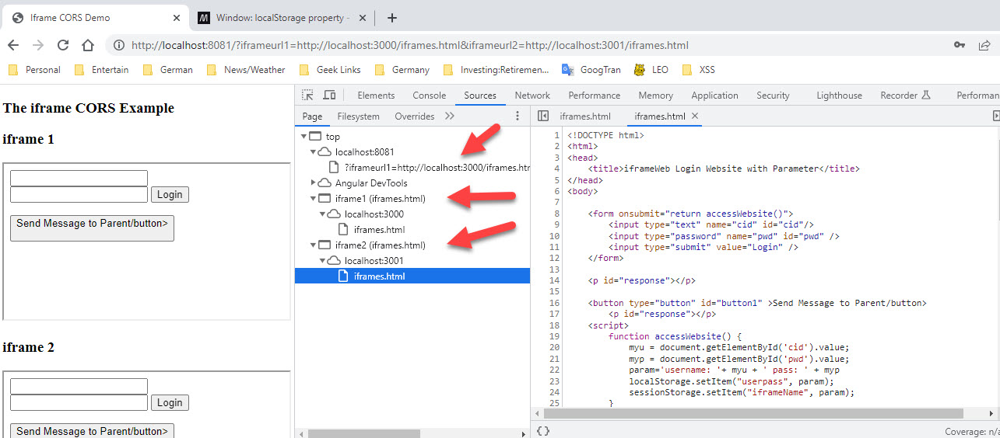

# CORS Demo Lab

One of the elements missing when watching YouTube videos explaining technology, is the hands on experience
to explore the "What Ifs" along with seeing both sides of the client-server interaction on a step-by-step
basis. This is the only way to fully understand how a technology works.

Single-Origin-Policy (SOP) and Cross-Origin-Requests (CORS) are easy to understand at a high
level, but once one reads all the rules behind it, becomes very complex. There are a lot of
"Rule XXX is always true EXCEPT in these cases". So in order to explore the intracies of 
CORS "What-Ifs", I created a Golang based CORS lab.

This CORS security lab allows users to explore both the client and server
side of CORS. Users can manipulate both the Client JavaScript and Server GO HTTP header CORS
attributes and view what the results are.

This is done thru the use of a main program and two iframes, all in different origins via
unique port numbers. The main program is a web server that forks to sub-processes all with
different port numbers which makes the document.location.origin unique. Users can then switch
between the 3 JS contexts (main, iframe1, iframe2) and view how CORS impacts accessing data
from the different origins. Users can do this with both

- getElementById() to retireve data between origins
- postMessage between iframes to retrieve data

## Installation

—-------------
 Create a golang HELLO WORLD project---------------
- https://go.dev/doc/install
- Download     https://go.dev/dl/
- https://go.dev/doc/tutorial/getting-started

—-------------
 Install CORS lab ---------------
- cd ..
- git clone https://github.com/dreezman/CORS-Demo-Lab.git

```
// Unix
kill $(jobs -p) ; sleep 3 ; go run main.go TLD 8081 & go run main.go iframe1 3000 & go run main.go iframe2 3001 &

// Windows
get-job| stop-job | remove-job ; go run main.go TLD 8081 & go run main.go iframes 3000 & go run main.go iframes 3001 &
```

## Usage

Wait for program to start, takes 30 seconds, then browse to main web server it will load the HTML into all the 3 web servers from each
or their respective origins.
```
http://localhost:8081/?iframeurl1=http://localhost:3000/iframes.html&iframeurl2=http://localhost:3001/iframes.html
```



Now press on the "Send Message" buttons to send messages postMessages between the 
iframes and the parent, all in different origins. 

Use Chrome Inspector or Firefox Debugger, to monitor the network traffic and inspect the header fields for the CORS headers. 


You can then modify the main.go program to change HTTP header fields and watch the errors occur in the console.
```
const addOriginHeader = false                    // add Access-Control header to HTTP response
var AllowOrigin string = "http://localhost:8081" // Choose a Access-Control origin header
//var AllowOrigin string = "http://localhost:3000"
//var AllowOrigin string = "http://localhost:3001"
//var AllowOrigin string = "http://localhost:222"
//var AllowOrigin string = "*"
```


You can also use the Inspector Console to manually do queries between the 3 origins to see if you can read the responses to the queries.


```
response=await fetch("http://localhost:8081/get-json"); await response.text()
response=await fetch("http://localhost:3000/get-json"); await response.text()
```
 

Also try reading local storage to/from different origins to see if you can access local storage.


```
# From Parent to Iframes
window.frames[0].localStorage
window.frames[1].localStorage
# From Iframes to each other
window.parent.frames[0].localStorage
window.parent.frames[1].localStorage
# From Iframes to parent
window.parent.localStorage
```


Video coming soon...


## Contributing

Pull requests are welcome. For major changes, please open an issue first
to discuss what you would like to change.

Please make sure to update tests as appropriate.

## License

- [MIT](https://choosealicense.com/licenses/mit/)
- [GO](https://go.dev/LICENSE)